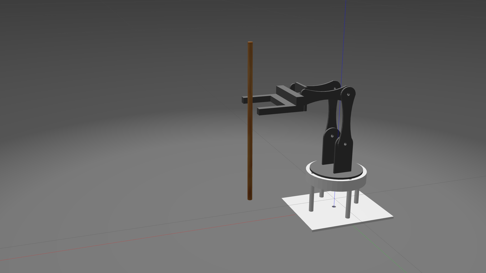
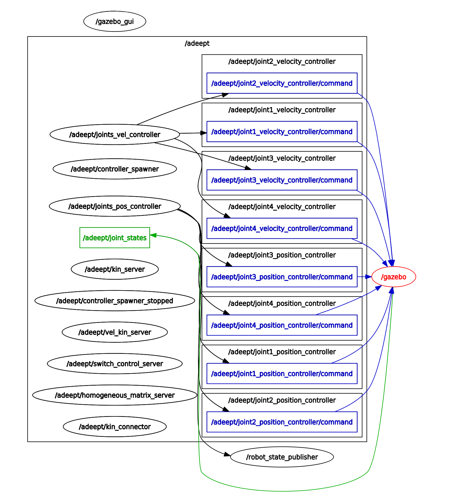

# 15Adeept-4-DOF-Robot-for-Caligraphy

**Author**:  WPI RBE 501 2020 Spring Team: [Jessica  Herman](https://github.com/KatConroy57), [Xinxiao Li](https://github.com/thejose5), [Anqi Shen](https://github.com/joeyzhong90595), [Zhuoyun Zhong](https://github.com/joeyzhong90595).



## Install & Build

**Environment**: Ubuntu 18.04 + ROS Melodic

**Prerequisite**

Install gazebo controllers:

`sudo apt-get install ros-melodic-joint-state-controller`

`sudo apt-get install ros-melodic-effort-controllers`

`sudo apt-get install ros-melodic-position-controllers`

To use Arduino (Hardware) in ROS, follow the instructions to [install Arduino IDE](http://wiki.ros.org/rosserial_arduino/Tutorials/Arduino%20IDE%20Setup) and [install rosserial library](http://wiki.ros.org/rosserial_arduino/Tutorials/Arduino%20IDE%20Setup).

**Build Instruction**

1. Clone this repository under **catkin_ws/src/**
2. Compile under **catkin_ws**: `catkin_make`
3. Go to path: **catkin_ws/src/Adeept-4-DOF-Robot-for-Caligraphy/adeept_command/src/**
4. Give python files permission: `chmod +x get_homogeneous.py adeept_connector.py adeept_kin_server.py joints_pos_controller.py joints_vel_controller.py adeept_VK_server.py switch_control.py `.

## Launch the Adeept Robot

To see the robot in rviz:

`roslaunch adeept_description adeept_rviz.launch`

Or to generate the robot in gazebo:

`roslaunch adeept_gazebo adeept_world.launch`

After launching in gazebo, one can try to control the robot by

`rostopic pub -1 /adeept/joint1_position_controller/command std_msgs/Float64 "data: 0.5"`

To launch all the command nodes:

`roslaunch adeept_command command.launch`

Available services list:

```
/adeept/for_kin
/adeept/inv_kin
/adeept/check_fk
/adeept/check_ik
/adeept/vel_for_kin
/adeept/vel_inv_kin
/adeept/set_joint_pos_ref
/adeept/set_joint_vel_ref
/adeept/set_cartesian_pos_ref
/adeept/set_cartesian_vel_ref
```


## Project Detail

For the robot kinematics, the code Implemented two nodes including a forward kinematic node and a connector. After opening all the nodes, there will be some services. The first node provide inverse kinematic and forward kinematic calculation.

`rosservice call adeept/inv_kin x, y, z, phi, theta, psi` 

`rosservice call adeept/for_kin q1, q2, d3 `

The connector builds bridges for connecting gazebo robot and kinematic nodes. The service it provides does not need any input but requires that the robot in gazebo is working. It takes the pose/joint variables of the robot in gazebo and calls `compute_ik`/`compute_fk` to compute the result. It will give both the computed joint variables/pose result and gazebo joint variables/pose data for comparison. If the error is less than 0.01, one could confirm that the nodes are working correctly.

`rosservice call adeept/check_ik` 

`rosservice call adeept/check_fk` 

---

@TODO

In terms of the velocity kinematic part, codes for forward and inverse velocity kinematic were implemented. The node provides inverse velocity kinematic and forward velocity kinematic calculation.

`rosservice call adeept/vel_inv_kin q1, q2, q3, x, y, z, Vx, Vy, Vz, Wx, Wy, Wz` 

`rosservice call adeept/vel_for_kin q1, q2, q3, q1_dot, q2_dot, q3_dot`

---

Also, the code implemented position and velocity controllers to perform joint movements. 

To give a reference position to the PID controller of joint 1:

`rosservice call adeept/set_joint_pos_ref '{joint_name: joint1, ref: 1.0}'`  

One should be able to see the joint 1 moves to the desired position.

The default controller of the robot is the position controller. In order to use a velocity controller, we need to use `controller manager`of ROS to switch from position controller to velocity controller.

`rosservice call /adeept/controller_manager/switch_controller '{start_controllers: [joint1_velocity_controller], stop_controllers: [joint1_position_controller], strictness: 2, start_asap: True, timeout: 2.0}`

To give a reference speed to the velocity PID controller:

`rosservice call adeept/set_joint_vel_ref '{joint_name: joint1, ref: 0.1}'`  

One should be able to see the joint 1 moves at desired speed.

We tuned the parameters and changed the PID values in the file `adeept_control/config/adeept_control.yaml` as follows:

| Controller | Kp   | Ki   | Kd   |
| ---------- | ---- | ---- | ---- |
| Joint1_pos | 20.0 | 2.0  | 6.0  |
| Joint2_pos | 15.0 | 3.0  | 5.0  |
| Joint3_pos | 15.0 | 3.0  | 4.0  |
| Joint4_pos | 15.0 | 3.0  | 3.0  |
| Joint1_vel | 30.0 | 1.0  | 0.0  |
| Joint2_vel | 30.0 | 1.0  | 0.0  |
| Joint3_vel | 30.0 | 1.0  | 0.0  |
| Joint4_vel | 30.0 | 1.0  | 0.0  |

To tune the value and see the result in real time, suggest using `rqt`. More detail of tunning process can refer to [Gazebo Control Tutorial](http://gazebosim.org/tutorials?tut=ros_control).

---

The final goal of the this project is to combine inverse position and inverse velocity kinematics with position and velocity controllers. In this way, when one gives the robot a Cartesian coordinate or a desired speed of the end of effector, the robot could figure out how to react using inverse kinematics, which is usually what people would like the robots to do.

First, as mentioned before, position controllers and velocity controllers are two different controllers, one can only use one of them for controlling one joint. To switch controller of all the three joints between position controllers and velocity controllers, one can use the server provided by `switch_control.py`. The parameter "p2v" represents changing from position controller to velocity controller and "v2p" plays a similar role.

`rosservice call adeept/switch_control 'p2v'` 

`rosservice call adeept/switch_control 'v2p'` 

@TODO

Now combined with inverse kinematics, it could also find its way given a desired world coordinates or desired Cartesian velocity.

`rosservice call adeept/set_cartesian_pos_ref x y z` 

`rosservice call adeept/set_cartesian_vel_ref Vx Vy Vz Wx Wy Wz` 

Noted that if the robot could not go to an invalid coordinates (x, y, z), it would not move and a "false" will be given. For the velocity one, the joint speed limitation is set to about 0.4 due to safety setting by velocity controller. When the joint speed given to joints exceeds that, it will stay in 0.4, ending up an undesired trajectory.

A valid example would be:

`rosservice call adeept/set_cartesian_pos_ref "{x: 0.1, y: 0.07, z: 0.152}"` `

`rosservice call adeept/switch_control 'p2v'`

`rosservice call adeept/set_cartesian_vel_ref "{Vx: 0, Vy: 0, Vz: 0, Wx: 0, Wy: 0, Wz: 0.1}"`

One should be able to see that the robot moves to (0.1, 0, 0.14) in the world coordinate. Then it moves around the +z direction for 3 seconds at a speed of 0.1.

## Node graph:


